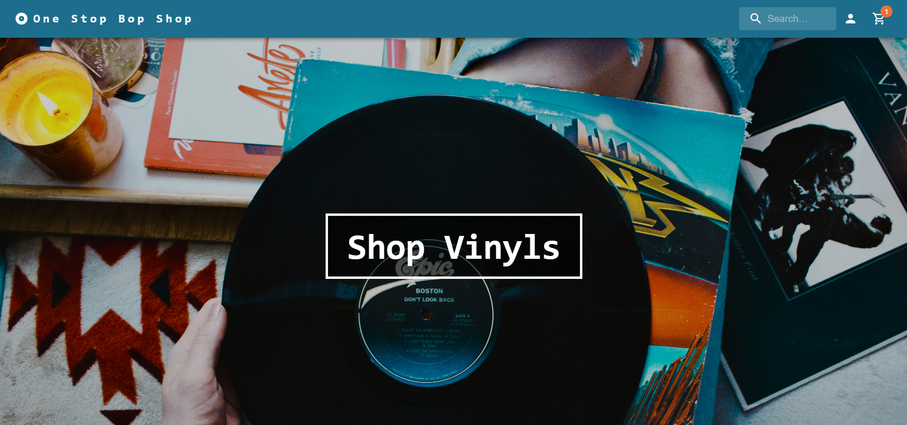
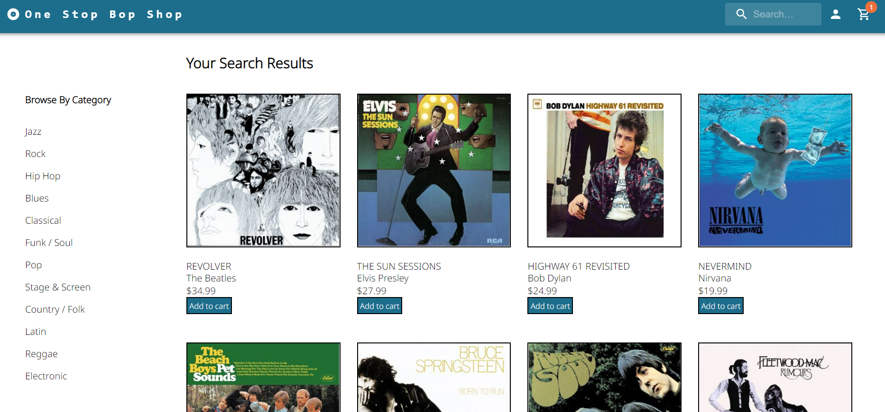
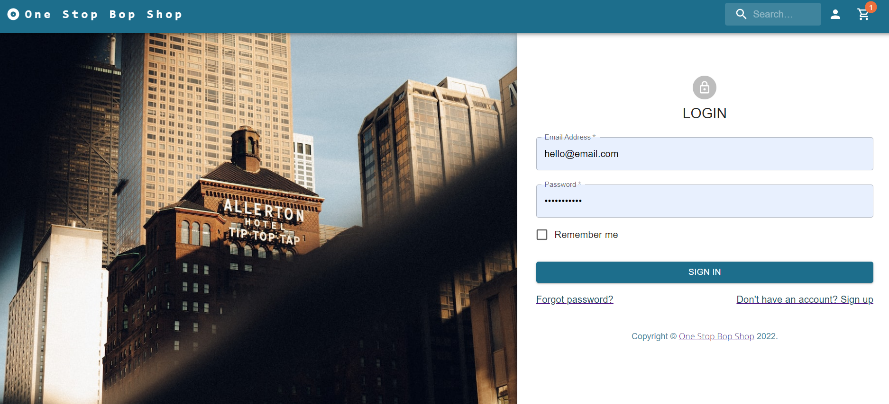

# One Stop Bop Shop
    
## Description
    
This project is a MERN stack application with STRIPE functionality and MaterialUI styling for a make-believe Vinyl Shop. The application will allow shop customers to browse and search the shop inventory, add and remove items fromt ehir shopping cart, and checkout when done shopping.
    
## Table of Contents

[Description](#description)

[User Stories](#user-stories)

[Link](#link)

[Screen shots](#screen-shots)

[Collaborators](#collaborators)

[License](#license)

[Questions](#questions)

## User Stories

    AS a Music Lover
    I want to have a website where I can search, select, and purchase my favorite vinyl records
    So that I can shop from the comfort of my own home.

    AS a Vinyl Record Shop Owner
    I want my customers to be able to use my shop website to see what I have in stock and buy items online
    So that my shop can reach a wider clientele base.

## Link

[https://one-stop-bop-shop.herokuapp.com/](https://one-stop-bop-shop.herokuapp.com/)

## Screen Shots

## Usage instructions

Upon loading the app the user can find the signup/login pages by clicking on the person icon in the top right corner of the site in the navigation bar. Once a user is created an account and signed in the user may click on either the vinyl shop button at the top of the home page, or may search by genre lower down to then be taken to the inventory page with all the records available for purchase. Each item has a button which, on click, adds the item to the cart, indicated by a shopping cart icon in the navbar. Once the user has selected everything they wish to purchase, they may then click on the shopping cart and see a checkout button, which would take them to the checkout page where they could then input their payment information and check out their items. 

## Collaborators

Emily Rose

Nathan Soum

Tabitha Spencer-Salmon

Chase Stratton
    
## License 

    
## Questions?

[https://github.com/emilyrose](https://github.com/emilyrose)

[https://github.com/natesoum](https://github.com/natesoum)

[https://github.com/TabithaLy](https://github.com/TabithaLy)

[https://github.com/Chasek6](https://github.com/Chasek6)